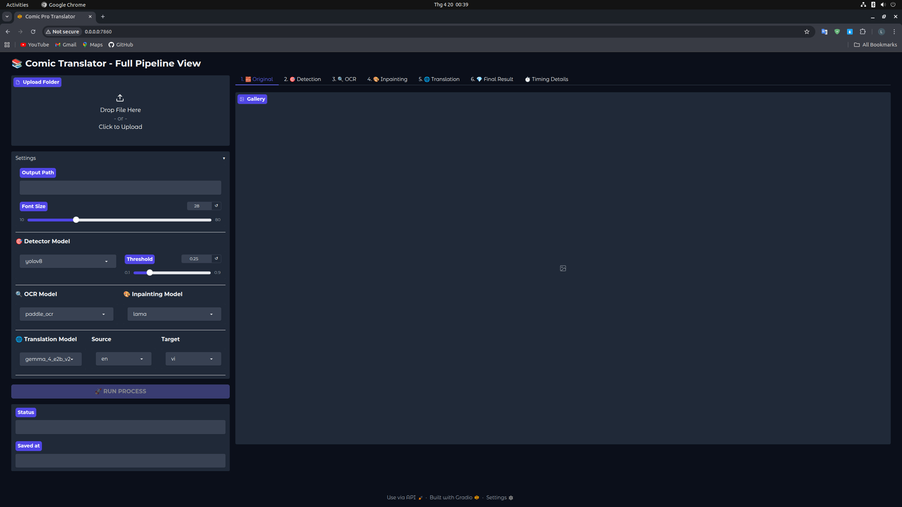

# 📚 Comic Pro Translator

**Comic Pro Translator** là một công cụ dịch thuật truyện tranh tự động.

---

## 🛠 Quy trình xử lý (Pipeline)

Quy trình hoạt động được chia thành 6 bước hiển thị trực quan trên giao diện Gradio:

### 1. 🧱 Ảnh gốc (Original)
Hệ thống tiếp nhận các định dạng ảnh phổ biến (`.jpg`, `.png`, `.webp`,...). Các tệp trong thư mục sẽ được sắp xếp theo thứ tự tự nhiên để đảm bảo đúng tiến trình truyện.

### 2. 🎯 Nhận diện khung thoại (Detection)
Sử dụng model **YOLOv8** để xác định chính xác vị trí các bong bóng thoại (speech bubbles). Bước này giúp khoanh vùng phạm vi cần xử lý chữ mà không làm ảnh hưởng đến các chi tiết khác của tranh.

### 3. 🔍 Nhận diện chữ (OCR)
Sử dụng **PaddleOCR** để trích xuất văn bản từ các vùng đã nhận diện. Công cụ hỗ trợ nhận diện đa ngôn ngữ (Nhật, Trung, Hàn, Anh...).

### 4. 🎨 Xóa chữ gốc (Inpainting)
Sử dụng AI chuyên dụng **LaMa (Resolution-robust Large Mask Inpainting)** để xóa bỏ văn bản gốc. Model này có khả năng "lấp đầy" vùng trống bằng cách tái tạo lại phông nền của tranh một cách tự nhiên.

### 5. 🌐 Dịch thuật (Translation)
Văn bản được đưa qua các model ngôn ngữ lớn (LLM) như **Gemma** để dịch sang ngôn ngữ đích. Hệ thống cung cấp bảng đối chiếu văn bản gốc và văn bản dịch để người dùng dễ dàng kiểm soát chất lượng.

### 6. 💎 Kết quả cuối cùng (Final Result)
Văn bản dịch được chèn ngược lại vào khung thoại bằng bộ renderer thông minh, tự động căn giữa và điều chỉnh kích thước phù hợp với khung.

---

## 🚀 Tính năng nổi bật

* **Xử lý hàng loạt (Batch Processing):** Hỗ trợ xử lý toàn bộ thư mục truyện chỉ với một lần nhấn nút.
* **Tùy biến cao:** Cho phép thay đổi model Detector, OCR, Translator, Inpainter ngay trên UI.
* **Thống kê chi tiết:** Bảng **Timing Details** ghi lại chi tiết thời gian thực hiện của từng bước cho từng trang truyện.